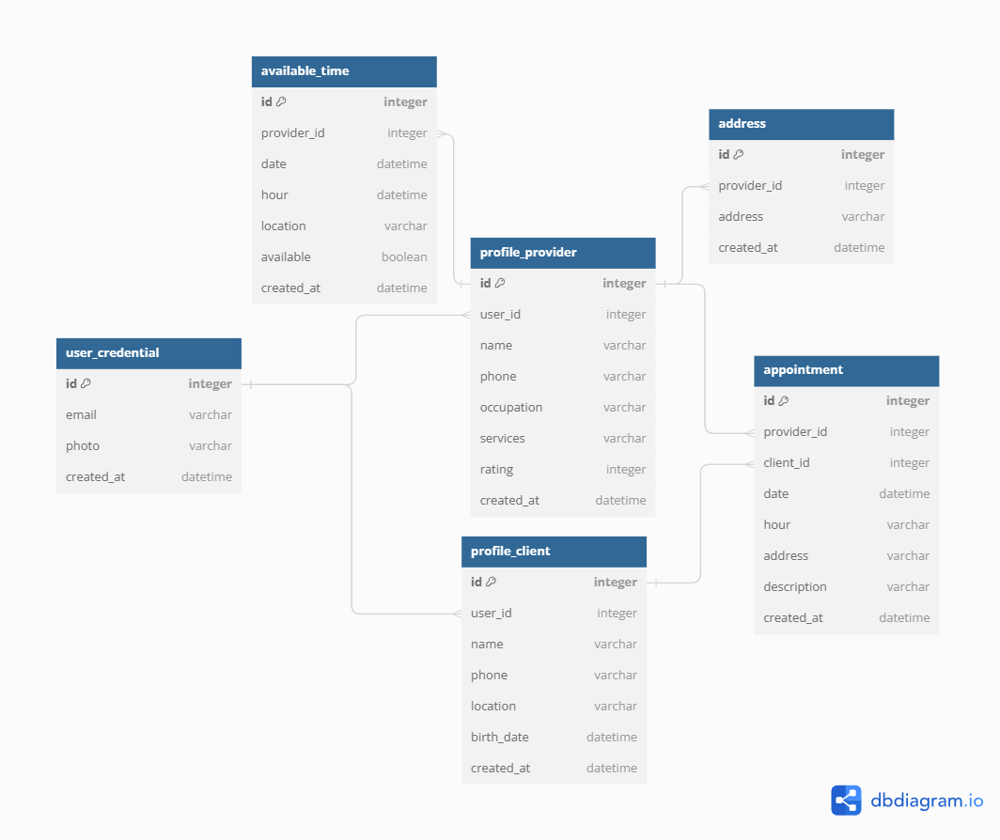

# Final Project

## C-Tas - Appointment Management Application

## Project Description

C-Tas is an innovative mobile appointment management application designed to streamline the organization and administration of appointments for professionals and their clients. The platform offers an intuitive and practical experience for connecting service providers with their clients, optimizing planning, and communication.

## Key Features

- **Smart Appointment Calendar**: Service providers can efficiently schedule, view, and manage their appointments through an easy-to-use calendar interface. Clients can view available dates and times and book their appointments with a single click.

- **Notifications and Reminders**: C-Tas sends automatic notifications and reminders to both service providers and clients before the appointment date, reducing no-shows, and improving punctuality.

- **Customer History**: The application stores a comprehensive appointment history for each client, including details of previous appointments, treatments, diagnoses, and comments from service providers. This allows for a personalized approach and a better understanding of the client's needs.

- **Customized Profiles**: Service providers can create detailed profiles with relevant information about their specialty, experience, schedules, and a biography highlighting their expertise and skills. Clients can easily access this information to make informed decisions when choosing a service provider.

## Benefits

- **Increased Efficiency**: C-Tas optimizes appointment scheduling, allowing professionals to make better use of their time and improve customer satisfaction by reducing wait times.

- **Improved Communication**: The application facilitates communication between service providers and clients through internal messaging, enabling clarification of doubts, sending personalized reminders, and providing a more personalized service.

- **Reviews and Ratings**: Clients can leave reviews and ratings for service providers, helping other users make informed decisions when selecting a professional.

- **User Experience**: C-Tas offers a user-friendly and customizable interface, enhancing the user experience and encouraging repeat usage of the application.

## Project Objective

The main objective of C-Tas is to revolutionize how professionals and clients manage and coordinate their appointments by offering a comprehensive and reliable solution that enhances efficiency and satisfaction for both parties. C-Tas aims to become the go-to application for appointment management, providing a comfortable, secure, and effective experience for all involved users.

## Functional Requirements

- **User Registration with Google or Facebook**: Users should be able to register in the application exclusively using their Google or Facebook accounts. The application must allow new users to authenticate their identity and quickly access the platform through these login options.

- **Profile Data Synchronization**: When a user registers or logs in with Google or Facebook, the application should automatically synchronize basic profile data (name and email address) from the corresponding account.

- **Additional Profile Creation**: After registering or logging in with Google or Facebook, users should be able to complete their profile in the application by providing additional required information, such as their specialty, occupation, phone number, and a biography for service providers.

- **Profile Management**: Users should be able to edit and update their profile information at any time. This includes the ability to change the profile picture, update the biography, adjust appointment availability, and modify the specialty (for service providers).

- **Search and Filter Service Providers**: Clients should be able to search and filter service providers based on their specialty, location, rating, and availability. This will make it easier for clients to find the most suitable service provider for their needs.

- **Intuitive Calendar Interface**: Service providers should have access to a clear and easy-to-use calendar interface where they can view their scheduled appointments, add new appointments, and adjust their availability.

- **Appointment Confirmation and Cancellation**: Clients should receive confirmation of their appointments once they have scheduled them. Additionally, they should be able to cancel appointments with sufficient notice and receive notifications about cancellation policies.

- **Review and Rating System**: After completing an appointment, clients should be able to leave reviews and ratings for service providers. This will help maintain a high level of quality and trust on the platform.

## Non-Functional Requirements

- **Intuitive and Attractive Interface**: The user interface should be intuitive and easy to use, with an attractive and consistent design. Navigation elements, buttons, and menus should be logically organized to facilitate user interaction.

- **Customizability**: The application should allow users to customize certain aspects of the interface, such as choosing themes, colors, or visual preferences, to tailor it to their individual preferences.

- **Consistent User Experience**: The application should maintain a consistent user experience across all screens and functionalities. Visual elements, navigation, and interactions should follow the same style and pattern throughout the application.

- **Predictable Behavior**: The application should respond predictably to user actions, avoiding unexpected behaviors that could lead to confusion or errors.

## Interface Design

In the following link, you can find the document where we designed the necessary user interfaces for the application.

We used Figma as the tool. [View on Figma](https://www.figma.com/file/ItRKm5J5hySQ2j3PSVqmrh/C-tas?type=design&node-id=0%3A1&mode=design&t=KDF1FT5jkTRrH8is-1)

## Conceptual Database Model (ERD) Design

The database model was documented using the dbdiagram.io tool, which allowed us to generate a visual representation of the ERD and a textual description of the entities, attributes, and relationships.

Based on the identification of entities and relationships, we proceeded to create the Entity-Relationship Diagram (ERD) representing the conceptual database model. Below is a graphical view of the ERD:

You can also view it at: [Database Model / C-tas](https://dbdiagram.io/d/64bf1d5e02bd1c4a5ea00db7)

To ensure the integrity and efficiency of the database model, the normalization process was carried out. It was verified that entities were in the appropriate normal form to minimize redundancy and ensure data consistency.